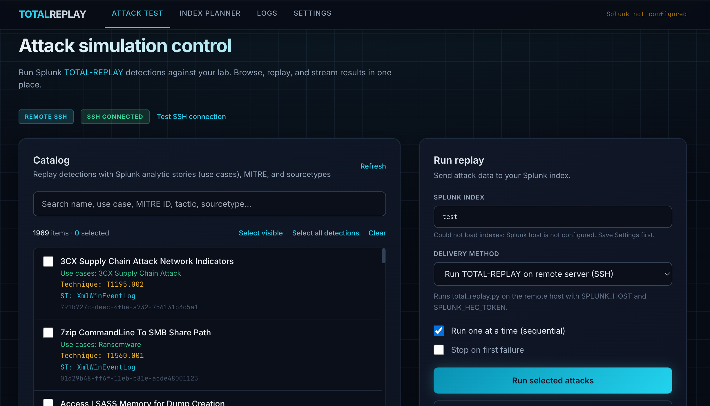
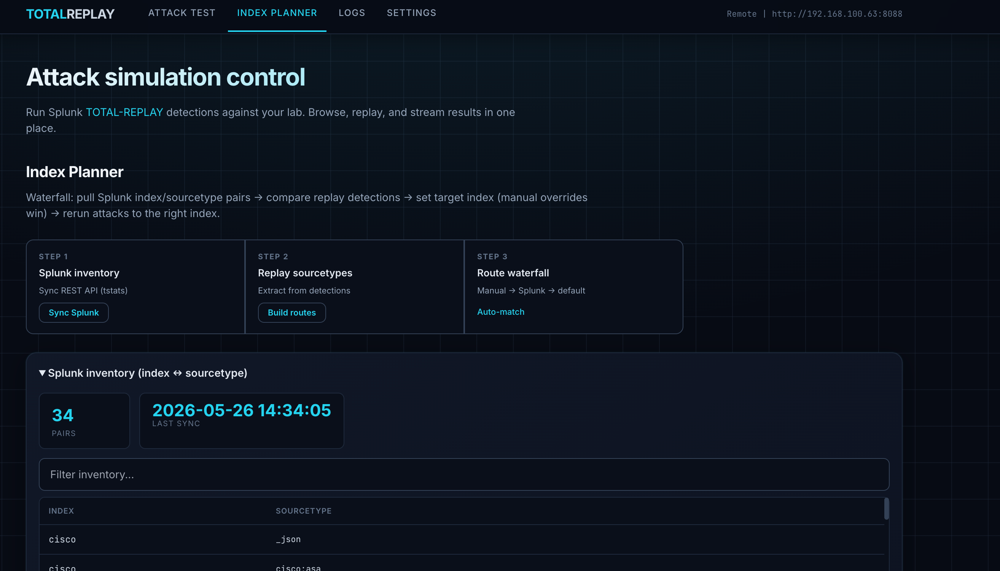
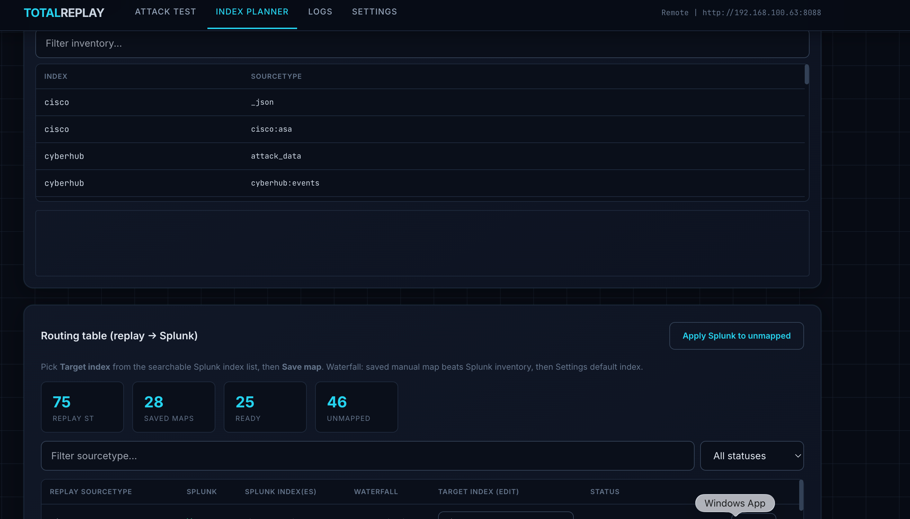
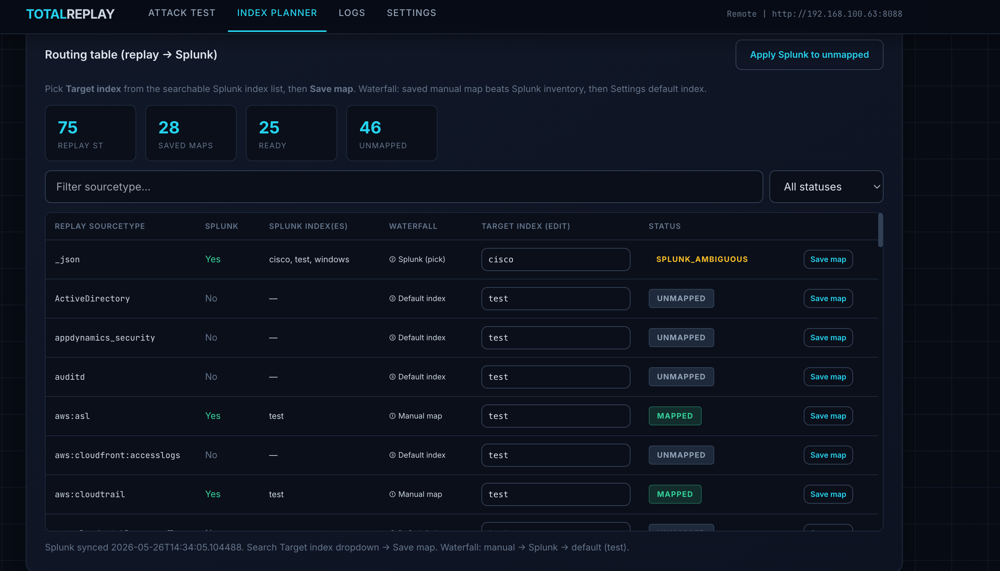
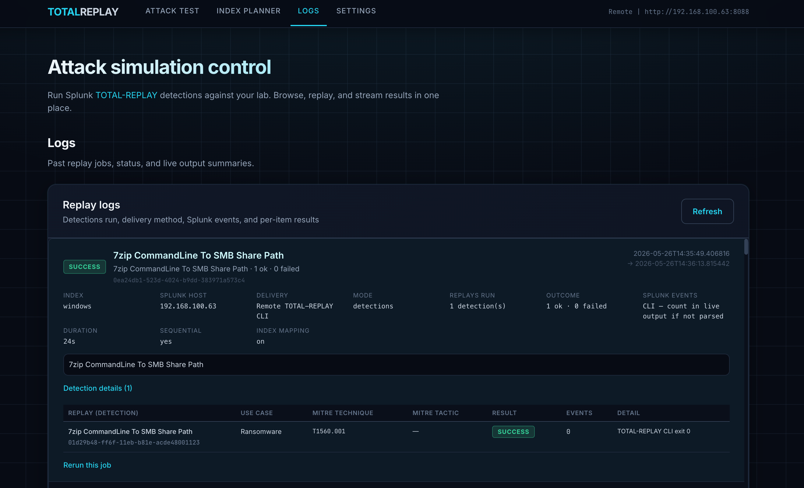
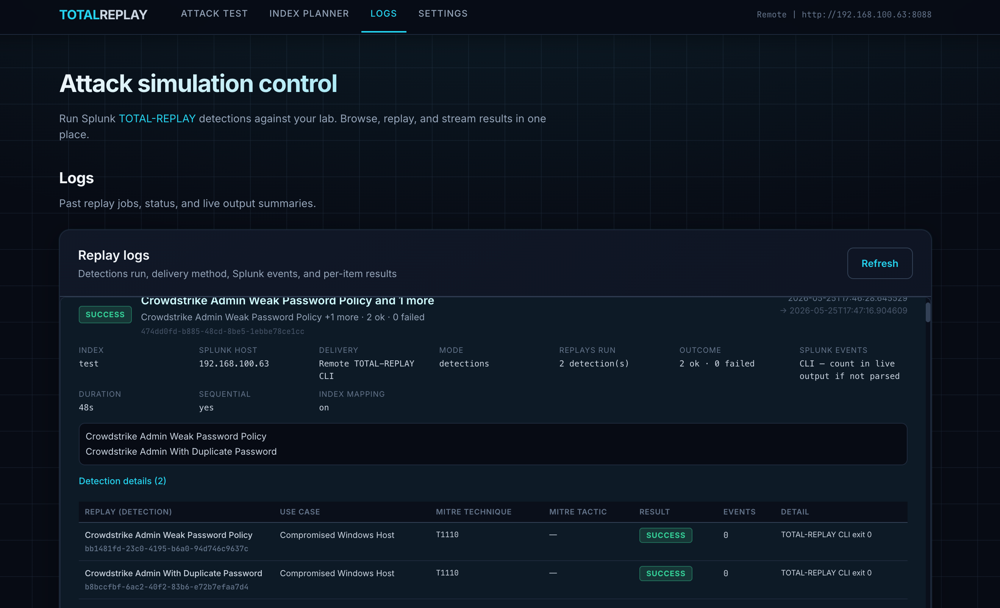
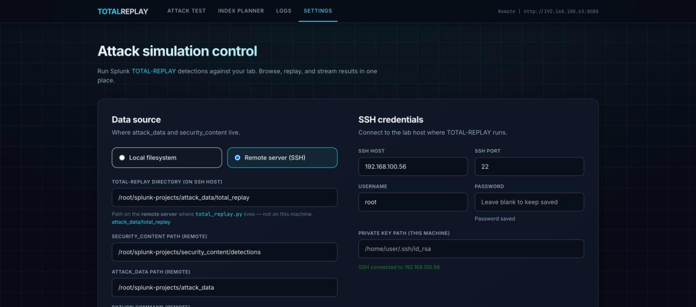

<p align="center">
  
</p>

<h1 align="center">TotalReplay UI</h1>

<p align="center">
  <a href="https://github.com/threathawk/TotalReplayUI">github.com/threathawk/TotalReplayUI</a>
</p>

<p align="center">
  <strong>A professional web console for ~2000 Splunk attack simulation — browse detections, replay attacks, and stream results in one place.</strong>
</p>

<p align="center">
  <a href="https://github.com/threathawk/TotalReplayUI/stargazers"></a>
  <a href="https://www.python.org/downloads/"></a>
  
  
</p>

<p align="center">
  <a href="#features">Features</a> •
  <a href="#screenshots">Screenshots</a> •
  <a href="#quick-start">Quick Start</a> •
  <a href="#configuration">Configuration</a> •
  <a href="#architecture">Architecture</a> •
  <a href="#security">Security</a> •
  <a href="#contributing">Contributing</a>
</p>

---

## Overview

**TotalReplay UI** is a Flask-powered web console that brings a clean, dark-themed dashboard to [Splunk TOTAL-REPLAY](https://github.com/splunk/attack_data/tree/master/total_replay) and [attack_data](https://github.com/splunk/attack_data). Designed for blue teamers, detection engineers, and SOC analysts who need to quickly replay real-world attack data against their Splunk environment and validate detections.

Whether your lab is local or remote, TotalReplay UI abstracts the CLI complexity into a single, intuitive browser interface — complete with live log streaming, MITRE ATT&CK metadata, index mapping, and replay history.

---

## Features

### Attack Simulation
- **Attack Catalog** — Browse hundreds of Splunk security_content detections with MITRE ATT&CK IDs, tactics, use cases, and sourcetypes
- **Multi-Select Replay** — Select multiple detections and run them sequentially or in parallel
- **Live Output Streaming** — Real-time SSE log streaming so you watch replays execute as they happen
- **Flexible Delivery** — Choose how attack data reaches Splunk: local CLI, remote SSH CLI, or Web HEC push

### Lab Connectivity
- **Local Mode** — Runs `total_replay.py` on the same machine as the web UI; ideal for single-host labs
- **Remote SSH Mode** — Connects to a lab VM over SSH; browses the remote catalog and runs replays on the remote host
- **SSH Tunnel for HEC** — Optionally tunnel HEC traffic through the SSH connection when Splunk is only reachable inside the lab network

### Index Intelligence
- **Index Planner** — Syncs Splunk index/sourcetype inventory via `tstats`; 3-step waterfall to map replay sourcetypes to correct target indexes
- **Auto-matching** — Automatically pairs detection sourcetypes with live Splunk inventory
- **Manual Override** — Set per-sourcetype index mappings that take priority over auto-match

### Operations
- **Replay Logs** — SQLite-backed history of every replay job: status, index, event count, and one-click rerun
- **Settings Panel** — Full configuration of paths, SSH credentials, Splunk HEC & Management API tokens, all in-browser
- **Config Load** — Populate paths automatically by reading the remote or local `config.yml`

---

## Screenshots

### Attack Test — Browse & Replay Detections


> Search by detection name, MITRE ID, tactic, or sourcetype. Select multiple detections and replay them with live output streaming.

### Index Planner — Sourcetype → Index Routing




> Sync your Splunk index/sourcetype inventory, build routes, and route replays to the right index automatically.

### Logs — Replay History



> View past replay jobs with status, delivery method, event count, and rerun capability.

### Settings — SSH & Splunk Configuration


> Configure local or remote (SSH) data sources, Splunk HEC tokens, and Management API credentials.

---

## Quick Start

### Prerequisites

| Requirement | Version |
|------------|---------|
| Python | 3.8+ |
| [TOTAL-REPLAY](https://github.com/splunk/attack_data/tree/master/total_replay) | Latest |
| [attack_data](https://github.com/splunk/attack_data) | Latest |
| [security_content](https://github.com/splunk/security_content) | Latest |
| Splunk | 8.x / 9.x with HEC enabled |

### Installation

```bash
# 1. Clone the repository
git clone https://github.com/threathawk/TotalReplayUI.git
cd TotalReplayUI

# 2. Create and activate a virtual environment
python3 -m venv .venv
source .venv/bin/activate        # Linux/macOS
# .venv\Scripts\activate.bat   # Windows

# 3. Install dependencies
pip install -r requirements.txt

# 4. Configure the app
cp data/config.json.example data/config.json
# Edit data/config.json with your settings (see Configuration below)

# 5. Launch
python app.py
```

Open **http://localhost:5055** in your browser. The server binds to `0.0.0.0:5055` for LAN access.

### Deploying on a server (git clone)

`data/config.json` is **not in git**. After `git clone`, create it on the server:

```bash
cp data/config.json.example data/config.json
chmod 600 data/config.json
```

SSH settings are stored on the **machine that runs** `python app.py` — they are not copied from your laptop.

| Setting | Meaning |
|--------|---------|
| **SSH host** | Lab VM the app connects **to** (must be reachable from the app host) |
| **Private key path** | On the **app host** (e.g. `/home/ubuntu/.ssh/id_rsa`), not the lab VM |
| **Connection mode** | **Remote server (SSH)** — click **Save settings** |

**Checklist:** Remote mode → Save → enter SSH password → Save again → **Test SSH**. Settings shows **Config file:** — that path must be writable.

Optional environment variables: `TOTALREPLAY_DATA_DIR`, `TOTALREPLAY_CONFIG`.

---

## Configuration

### Local Setup (TOTAL-REPLAY on this machine)

1. Clone [attack_data](https://github.com/splunk/attack_data) and [security_content](https://github.com/splunk/security_content) on this host.
2. Install TOTAL-REPLAY per the [upstream readme](https://github.com/splunk/attack_data/tree/master/total_replay).
3. In **Settings**, choose **Local filesystem**.
4. Set the TOTAL-REPLAY directory (e.g. `/opt/attack_data/total_replay`).
5. Click **Load paths from local configuration/config.yml** to auto-fill `security_content` and `attack_data` paths.
6. Set your Splunk host, HEC token, and default delivery method to **Run TOTAL-REPLAY on this machine (local CLI)**.

> Splunk must be reachable from this machine when using local CLI mode.

### Remote Server Setup (SSH Lab)

**On your lab VM** (where `attack_data` + `security_content` live):

```bash
# Clone repos and install TOTAL-REPLAY
poetry install        # inside total_replay/

# Edit total_replay/configuration/config.yml with correct paths
```

**In the web UI Settings:**

| Field | Value |
|-------|-------|
| Data source | Remote server (SSH) |
| TOTAL-REPLAY directory | e.g. `/opt/attack_data/total_replay` |
| SSH host | Lab VM IP or hostname |
| SSH user | Remote username |
| SSH auth | Password or private key path |
| Splunk host | Address reachable from replay origin |
| HEC token | Your Splunk HEC token |

Click **Test SSH** and **Test Splunk HEC** to validate before running replays.

### data/config.json Reference

```json
{
  "mode": "remote",
  "total_replay_dir": "/opt/attack_data/total_replay",
  "security_content_path": "/opt/security_content/detections",
  "attack_data_path": "/opt/attack_data",
  "splunk_host": "192.168.100.63",
  "splunk_hec_port": 8088,
  "splunk_hec_token": "your-hec-token-here",
  "splunk_default_index": "test",
  "ssh_host": "192.168.100.56",
  "ssh_port": 22,
  "ssh_user": "root",
  "ssh_key_path": "/home/user/.ssh/id_rsa",
  "delivery_method": "remote_cli"
}
```

> ⚠️ **Never commit `data/config.json`** — it contains credentials. It is already in `.gitignore`.

---

## Architecture

```
TotalReplayUI/
├── app.py                   # Flask application entry point & routes
├── detection_inventory.py   # Parses security_content detection catalog
├── local_replay.py          # Runs total_replay.py locally (subprocess)
├── remote_client.py         # SSH client (Paramiko) for remote labs
├── index_mapping.py         # Sourcetype → index routing logic
├── route_planner.py         # Index Planner: Splunk tstats + auto-match
├── splunk_client.py         # Splunk REST API client (management port 8089)
├── splunk_transport.py      # HEC event posting (local, SSH fetch, HTTP)
├── ssh_tunnel.py            # Optional SSH tunnel for HEC
├── ssh_connect.py           # Shared Paramiko SSH connection helpers
├── total_replay_cli.py      # CLI wrapper helpers
├── data/
│   ├── config.json.example  # Config template (safe to commit)
│   ├── config.json          # Live config with credentials (gitignored)
│   └── totalreplay.db       # SQLite replay history
├── templates/               # Jinja2 HTML templates
└── docs/                    # Logo and screenshots
```

### Delivery Methods

| Method | Description |
|--------|-------------|
| **Local CLI** | Runs `total_replay.py` on the machine hosting the web UI |
| **Remote CLI (SSH)** | Runs `total_replay.py` on the lab VM over SSH |
| **Web UI HEC** | Fetches attack logs (local path, SSH, or HTTP) and POSTs to Splunk HEC from the web UI |

### Index Routing Waterfall

```
Manual map (saved in config) → Splunk REST inventory → Settings default index
```

---

## Security

> TotalReplay UI is designed for **isolated lab environments**. Review these notes before deploying.

- **Credentials at rest** — HEC token, management API token, and SSH password are stored in plaintext in `data/config.json`. Restrict file permissions (`chmod 600 data/config.json`) and rotate credentials regularly.
- **Network exposure** — The app binds to `0.0.0.0:5055` by default. Restrict with a firewall or change the bind address in `app.py` for production use.
- **No authentication** — The web UI has no built-in login. Place it behind a VPN, SSH tunnel, or reverse proxy with auth if exposing beyond localhost.
- **SQLite database** — Replay history is stored in `data/totalreplay.db`. Keep this file private.

---

## References

- [Splunk TOTAL-REPLAY](https://github.com/splunk/attack_data/tree/master/total_replay) — The upstream CLI replay engine
- [attack_data](https://github.com/splunk/attack_data) — Splunk's curated attack dataset repository
- [security_content](https://github.com/splunk/security_content) — Splunk's detection catalog (ESCU)
- [MITRE ATT&CK](https://attack.mitre.org/) — Adversary tactics and techniques framework

---

## Contributing

Contributions, issues, and feature requests are welcome!

1. Fork the repository
2. Create a feature branch: `git checkout -b feature/my-feature`
3. Commit your changes: `git commit -m 'Add some feature'`
4. Push to the branch: `git push origin feature/my-feature`
5. Open a Pull Request

Please open an issue first to discuss significant changes.

---

<p align="center">
  Built for the Splunkers by Splunker</p></br>
  <sub>TotalReplay UI · <a href="https://github.com/threathawk/TotalReplayUI">github.com/threathawk/TotalReplayUI</a></sub>
</p>
